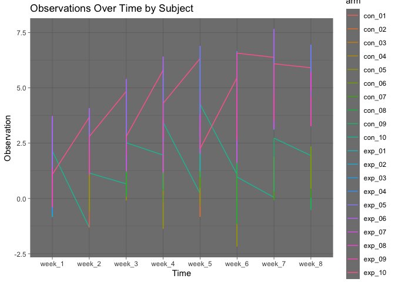
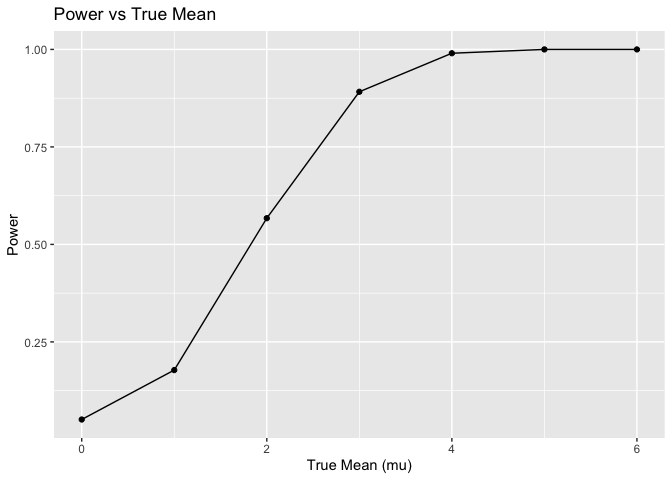
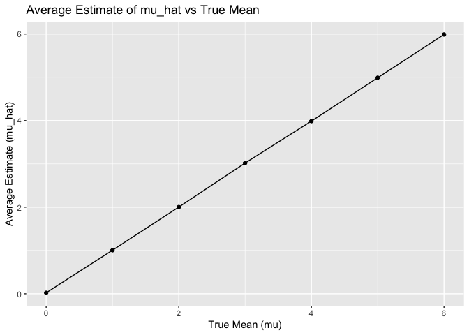
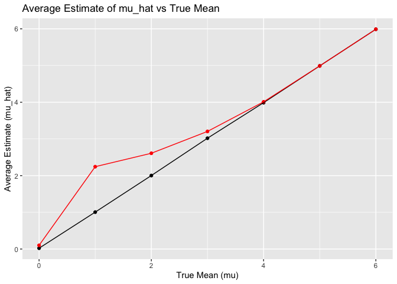

p8105_hw5_lt2949
================
Li Tian
2023-11-13

``` r
library(tidyverse)
```

    ## ── Attaching core tidyverse packages ──────────────────────── tidyverse 2.0.0 ──
    ## ✔ dplyr     1.1.3     ✔ readr     2.1.4
    ## ✔ forcats   1.0.0     ✔ stringr   1.5.0
    ## ✔ ggplot2   3.4.3     ✔ tibble    3.2.1
    ## ✔ lubridate 1.9.2     ✔ tidyr     1.3.0
    ## ✔ purrr     1.0.2     
    ## ── Conflicts ────────────────────────────────────────── tidyverse_conflicts() ──
    ## ✖ dplyr::filter() masks stats::filter()
    ## ✖ dplyr::lag()    masks stats::lag()
    ## ℹ Use the conflicted package (<http://conflicted.r-lib.org/>) to force all conflicts to become errors

``` r
library(purrr)
library(broom)
```

# Problem1

# Problem2

``` r
#Start with a dataframe of all file names
file_names <- list.files(path = "data", full.names = TRUE, pattern = "\\.csv$")
#Read data and extract IDs and arms:
data_list <- map(file_names, ~{
  data <- read_csv(.x)
  file_info <- str_match(.x, "([a-z]+)_([0-9]+)") 
  data <- data %>% 
    mutate(subject_id = file_info[2],
           arm = file_info[1])
})
```

    ## Rows: 1 Columns: 8
    ## ── Column specification ────────────────────────────────────────────────────────
    ## Delimiter: ","
    ## dbl (8): week_1, week_2, week_3, week_4, week_5, week_6, week_7, week_8
    ## 
    ## ℹ Use `spec()` to retrieve the full column specification for this data.
    ## ℹ Specify the column types or set `show_col_types = FALSE` to quiet this message.
    ## Rows: 1 Columns: 8
    ## ── Column specification ────────────────────────────────────────────────────────
    ## Delimiter: ","
    ## dbl (8): week_1, week_2, week_3, week_4, week_5, week_6, week_7, week_8
    ## 
    ## ℹ Use `spec()` to retrieve the full column specification for this data.
    ## ℹ Specify the column types or set `show_col_types = FALSE` to quiet this message.
    ## Rows: 1 Columns: 8
    ## ── Column specification ────────────────────────────────────────────────────────
    ## Delimiter: ","
    ## dbl (8): week_1, week_2, week_3, week_4, week_5, week_6, week_7, week_8
    ## 
    ## ℹ Use `spec()` to retrieve the full column specification for this data.
    ## ℹ Specify the column types or set `show_col_types = FALSE` to quiet this message.
    ## Rows: 1 Columns: 8
    ## ── Column specification ────────────────────────────────────────────────────────
    ## Delimiter: ","
    ## dbl (8): week_1, week_2, week_3, week_4, week_5, week_6, week_7, week_8
    ## 
    ## ℹ Use `spec()` to retrieve the full column specification for this data.
    ## ℹ Specify the column types or set `show_col_types = FALSE` to quiet this message.
    ## Rows: 1 Columns: 8
    ## ── Column specification ────────────────────────────────────────────────────────
    ## Delimiter: ","
    ## dbl (8): week_1, week_2, week_3, week_4, week_5, week_6, week_7, week_8
    ## 
    ## ℹ Use `spec()` to retrieve the full column specification for this data.
    ## ℹ Specify the column types or set `show_col_types = FALSE` to quiet this message.
    ## Rows: 1 Columns: 8
    ## ── Column specification ────────────────────────────────────────────────────────
    ## Delimiter: ","
    ## dbl (8): week_1, week_2, week_3, week_4, week_5, week_6, week_7, week_8
    ## 
    ## ℹ Use `spec()` to retrieve the full column specification for this data.
    ## ℹ Specify the column types or set `show_col_types = FALSE` to quiet this message.
    ## Rows: 1 Columns: 8
    ## ── Column specification ────────────────────────────────────────────────────────
    ## Delimiter: ","
    ## dbl (8): week_1, week_2, week_3, week_4, week_5, week_6, week_7, week_8
    ## 
    ## ℹ Use `spec()` to retrieve the full column specification for this data.
    ## ℹ Specify the column types or set `show_col_types = FALSE` to quiet this message.
    ## Rows: 1 Columns: 8
    ## ── Column specification ────────────────────────────────────────────────────────
    ## Delimiter: ","
    ## dbl (8): week_1, week_2, week_3, week_4, week_5, week_6, week_7, week_8
    ## 
    ## ℹ Use `spec()` to retrieve the full column specification for this data.
    ## ℹ Specify the column types or set `show_col_types = FALSE` to quiet this message.
    ## Rows: 1 Columns: 8
    ## ── Column specification ────────────────────────────────────────────────────────
    ## Delimiter: ","
    ## dbl (8): week_1, week_2, week_3, week_4, week_5, week_6, week_7, week_8
    ## 
    ## ℹ Use `spec()` to retrieve the full column specification for this data.
    ## ℹ Specify the column types or set `show_col_types = FALSE` to quiet this message.
    ## Rows: 1 Columns: 8
    ## ── Column specification ────────────────────────────────────────────────────────
    ## Delimiter: ","
    ## dbl (8): week_1, week_2, week_3, week_4, week_5, week_6, week_7, week_8
    ## 
    ## ℹ Use `spec()` to retrieve the full column specification for this data.
    ## ℹ Specify the column types or set `show_col_types = FALSE` to quiet this message.
    ## Rows: 1 Columns: 8
    ## ── Column specification ────────────────────────────────────────────────────────
    ## Delimiter: ","
    ## dbl (8): week_1, week_2, week_3, week_4, week_5, week_6, week_7, week_8
    ## 
    ## ℹ Use `spec()` to retrieve the full column specification for this data.
    ## ℹ Specify the column types or set `show_col_types = FALSE` to quiet this message.
    ## Rows: 1 Columns: 8
    ## ── Column specification ────────────────────────────────────────────────────────
    ## Delimiter: ","
    ## dbl (8): week_1, week_2, week_3, week_4, week_5, week_6, week_7, week_8
    ## 
    ## ℹ Use `spec()` to retrieve the full column specification for this data.
    ## ℹ Specify the column types or set `show_col_types = FALSE` to quiet this message.
    ## Rows: 1 Columns: 8
    ## ── Column specification ────────────────────────────────────────────────────────
    ## Delimiter: ","
    ## dbl (8): week_1, week_2, week_3, week_4, week_5, week_6, week_7, week_8
    ## 
    ## ℹ Use `spec()` to retrieve the full column specification for this data.
    ## ℹ Specify the column types or set `show_col_types = FALSE` to quiet this message.
    ## Rows: 1 Columns: 8
    ## ── Column specification ────────────────────────────────────────────────────────
    ## Delimiter: ","
    ## dbl (8): week_1, week_2, week_3, week_4, week_5, week_6, week_7, week_8
    ## 
    ## ℹ Use `spec()` to retrieve the full column specification for this data.
    ## ℹ Specify the column types or set `show_col_types = FALSE` to quiet this message.
    ## Rows: 1 Columns: 8
    ## ── Column specification ────────────────────────────────────────────────────────
    ## Delimiter: ","
    ## dbl (8): week_1, week_2, week_3, week_4, week_5, week_6, week_7, week_8
    ## 
    ## ℹ Use `spec()` to retrieve the full column specification for this data.
    ## ℹ Specify the column types or set `show_col_types = FALSE` to quiet this message.
    ## Rows: 1 Columns: 8
    ## ── Column specification ────────────────────────────────────────────────────────
    ## Delimiter: ","
    ## dbl (8): week_1, week_2, week_3, week_4, week_5, week_6, week_7, week_8
    ## 
    ## ℹ Use `spec()` to retrieve the full column specification for this data.
    ## ℹ Specify the column types or set `show_col_types = FALSE` to quiet this message.
    ## Rows: 1 Columns: 8
    ## ── Column specification ────────────────────────────────────────────────────────
    ## Delimiter: ","
    ## dbl (8): week_1, week_2, week_3, week_4, week_5, week_6, week_7, week_8
    ## 
    ## ℹ Use `spec()` to retrieve the full column specification for this data.
    ## ℹ Specify the column types or set `show_col_types = FALSE` to quiet this message.
    ## Rows: 1 Columns: 8
    ## ── Column specification ────────────────────────────────────────────────────────
    ## Delimiter: ","
    ## dbl (8): week_1, week_2, week_3, week_4, week_5, week_6, week_7, week_8
    ## 
    ## ℹ Use `spec()` to retrieve the full column specification for this data.
    ## ℹ Specify the column types or set `show_col_types = FALSE` to quiet this message.
    ## Rows: 1 Columns: 8
    ## ── Column specification ────────────────────────────────────────────────────────
    ## Delimiter: ","
    ## dbl (8): week_1, week_2, week_3, week_4, week_5, week_6, week_7, week_8
    ## 
    ## ℹ Use `spec()` to retrieve the full column specification for this data.
    ## ℹ Specify the column types or set `show_col_types = FALSE` to quiet this message.
    ## Rows: 1 Columns: 8
    ## ── Column specification ────────────────────────────────────────────────────────
    ## Delimiter: ","
    ## dbl (8): week_1, week_2, week_3, week_4, week_5, week_6, week_7, week_8
    ## 
    ## ℹ Use `spec()` to retrieve the full column specification for this data.
    ## ℹ Specify the column types or set `show_col_types = FALSE` to quiet this message.

``` r
#Tidy the data
tidy_data <- map(data_list, ~pivot_longer(.x, cols = -c(subject_id, arm), names_to = "time", values_to = "observation"))
all_data <- bind_rows(tidy_data)

#Spaghetti plot
ggplot(all_data, aes(x = time, y = observation, group = subject_id, color = arm)) +
  geom_line() +
  theme_dark() +
  labs(title = "Observations Over Time by Subject", x = "Time", y = "Observation")
```

<!-- --> The
spaghetti plot over the eight-week study period shows that observations
for both the experimental and control groups fluctuate, with the control
group displaying a broader variation as seen by the more dispersed data
points on the plot. No uniform trend, such as a consistent rise or fall,
is evident for either group; instead, there is a notable variance in the
data for individual participants. Determining clear differences between
the groups is not straightforward without a statistical examination
since both groups contain subjects whose observation levels peak and dip
at various intervals. Furthermore, the plot points to potential
outliers, especially within the control group, where certain
individuals’ data points significantly diverge from their peers at
specific times.

# Problem3

``` r
# Set design elements
n <- 30
sigma <- 5
mu_values <- 0:6
alpha <- 0.05
num_simulations <- 5000

# Function to perform simulations
simulate_power <- function(mu, n, sigma, num_simulations, alpha) {
  t_tests <- replicate(num_simulations, {
    sample_data <- rnorm(n, mean = mu, sd = sigma)
    t_test_result <- t.test(sample_data, mu = 0)
    tidy_t_test <- tidy(t_test_result)
    tidy_t_test
  }, simplify = FALSE) %>%
  bind_rows() %>%
  mutate(rejected = p.value < alpha)
  
  data.frame(
    mu = mu,
    power = mean(t_tests$rejected),
    mean_estimate = mean(t_tests$estimate),
    mean_estimate_rejected = mean(t_tests$estimate[t_tests$rejected])
  )
}

# Run simulation for each mu
results <- map_df(mu_values, ~simulate_power(., n, sigma, num_simulations, alpha))

# Plot the power vs true value of mu
ggplot(results, aes(x = mu, y = power)) +
  geom_point() +
  geom_line() +
  labs(title = "Power vs True Mean", x = "True Mean (mu)", y = "Power")
```

<!-- -->

The plot shows test power, the chance of rejecting a false null
hypothesis, rising with an increasing true mean, beginning from nearly
zero and approaching full power as the effect size grows, highlighting a
proportional link between effect size and test power.

``` r
# Plot the average estimate of mu_hat
ggplot(results, aes(x = mu, y = mean_estimate)) +
  geom_point() +
  geom_line() +
  labs(title = "Average Estimate of mu_hat vs True Mean", x = "True Mean (mu)", y = "Average Estimate (mu_hat)")
```

<!-- -->

The second graph displays a black line depicting the average estimate of
the sample mean mu hat as it corresponds to the true mean. The linear
relationship, with a slope around one, suggests that the sample mean
reliably reflects the true mean; it proportionately rises as the true
mean escalates, pointing to its unbiased nature in estimation.

``` r
# Overlay average estimate of mu_hat when null is rejected
ggplot(results, aes(x = mu)) +
  geom_point(aes(y = mean_estimate)) +
  geom_point(aes(y = mean_estimate_rejected), color = "red") +
  geom_line(aes(y = mean_estimate)) +
  geom_line(aes(y = mean_estimate_rejected), color = "red") +
  labs(title = "Average Estimate of mu_hat vs True Mean", x = "True Mean (mu)", y = "Average Estimate (mu_hat)")
```

<!-- -->

The third visualization introduces a red line which traces the average
estimate of mu hat in instances where the null hypothesis is rejected,
superimposed on the earlier plot. This line mostly mirrors the initial
one, yet it shows minor divergences. The proximity of these two lines
indicates that the sample mean continues to be a reliable estimator of
the true mean after the null hypothesis is declined, although minor
variations may arise due to the diversity among samples that lead to
null hypothesis rejection.
